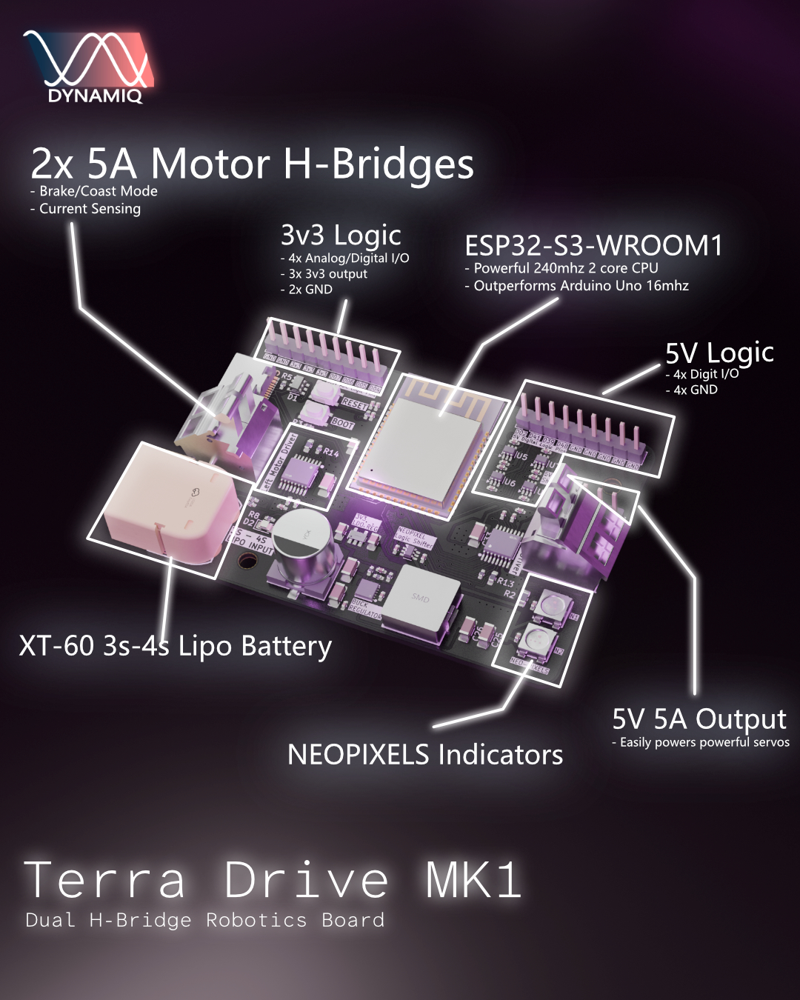

# TerraDrive



TerraDrive is a high-performance ESP32-S3 based development board engineered for robotics and motor control applications. It features dual on-board DRV8874 H-bridge motor drivers, a robust 5V/5A power delivery system, and direct 3-4S LiPo battery support via an XT-60 connector. 

This repository contains the core C++ library required to interface with the TerraDrive's hardware, including center-aligned motor control (via MCPWM), motor current sense, configurable 5V rail logic, and integrated status NeoPixels.


## ⚡ Hardware Features & Specifications

* **Microcontroller:** ESP32-S3
* **Motor Drivers:** 2x DRV8874PWPR H-Bridge Controllers with integrated independent current sensing and fault monitoring.
* **Power Input:** XT-60 Connector supporting 3S to 4S LiPo batteries.
* **Power Output:** Integrated high-current buck converter delivering a stable **5V @ 5A** rail. And a lower power 3v3 @ 1A rail shared with the ESP32 (So under Wifi load be sure not to stress the 3v3 rail).
* **GPIO Breakouts:**
  * 4x 5V @24mA Level-shifted/Digital read & write
  * 4x 3.3V Native ESP32-S3 Logic Pins (Built in ADC1 access)
* **Status LEDs:** 2x On-board WS2812B NeoPixels (GRB, 800kHz).

**CAD & Board schematics are provided in `hardware`**

## ⚡ Using the hardware

### How do I get started?
- Download **visual studio code**
- Install **platform IO** extension
- Fork this github repo
- Write away in `src/main.cpp`
- Stuck? Check `examples`

---

### I plugged the USB but it's off
Don't worry your board is not broken! This was intentionally designed to isolate the USB power from the lipo battery. So tinker away without worrying about blowing your laptops USB port :)

This means to power the board, the power source needs to be connected.

---

### Code not uploading
If your code does not want to upload. Place the ESP32 into boot mode by holding the boot button and simultaniously clicking reset once. (This ensures your Serial.print() doesn't interfere with software upload)


## 🛠️ Software API Overview

The `TerraDrive` C++ class handles low-level peripheral configuration (MCPWM initialization, ADC initialization, and GPIO multiplexing) so you can focus on building your application. Which sets up the H-Bridges, 5V logic pins and Neopixel access.

### 1. Initialization & Core Control
Instantiate the `TerraDrive` object and invoke `init()` in your startup sequence to configure the internal peripherals.

```cpp
#include "TerraDrive.h"

TerraDrive board;

void setup() {
    // Always initialise the board before everything else.
    board.init();
}
```

### 2. Motor Actuation (MCPWM)
The motor drivers utilize the ESP32-S3's hardware MCPWM unit, operating with a 4kHz center-aligned PWM frequency, providing high-resolution duty cycle adjustments (20000 PWM step resolution).

```cpp
void setEnableMotors(bool enable); // Enables or disables both H-Bridge Drivers

void setLeftMotor(float output); // Sets left motor output from -100 (Full Reverse) to 100 (Full Forward).

void setRightMotor(float output); // Sets right motor output from -100 (Full Reverse) to 100 (Full Forward).

bool isFaulted(); // Returns true if either H-bridge flags a hardware error (overtemperature, overcurrent, or undervoltage).
```
---

### 3. Voltage & Current Sensing
The library leverages one-shot ADC configurations (esp_adc) to convert internal hardware sensor voltages into physical units.

```cpp
float getLipoVoltage() const; // Returns the real-time battery voltage in Volts.

float getLeftCurrentRaw() const; // Returns the instantaneous raw left motor current in Amps.

float getRightCurrentRaw() const; // Returns the instantaneous raw right motor current in Amps.
```
Note: The raw current is very noisy for low current motors. A filter is suggested.

---

### 4. 5V Pin Control
Because the 4x 5V digital pins rely on dual-line directional routing logic, use the explicit hardware wrapper to manipulate their state.
```cpp
void pinMode5V(Pins5v pin, uint8_t state);
```
Supported Pin Enums: `Pins5v::PIN2, Pins5v::PIN41, Pins5v::PIN39, Pins5v::PIN48`

#### Example Usage
```cpp
    TerraDrive board{}
    void setup() {
        board.init();
        board.pinMode5V(Pins5v::PIN2, OUTPUT); // Or INPUT there is no pull up nor pull down
    }
    void loop() {
        // digital write and use pin 2 normally
        digitalWrite(2, HIGH);
        delay(1000);
        digitalWrite(2, LOW);
        delay(1000);
    }

```


---

### 5. NeoPixel Interface
The library natively encapsulates the Adafruit_NeoPixel framework. You can extract the instance reference directly to change pixel arrays.

```cpp
#include <Adafruit_NeoPixel.h>
Adafruit_NeoPixel& leds = board.getNeoPixel();
leds.setPixelColor(0, leds.Color(0, 255, 0)); // Drive the first NeoPixel Green
leds.show();
```
---

### 6. Using Wifi & Bluetooth
When using the built in Wifi or Bluetooth of the ESP32 board, motor current sensing and lipo voltage sensing needs to be disabled. As Wifi and bluetooth takes over ADC2.
```cpp
TerraDrive board{}
void setup() {
    board.init(true); // disables ADC2 initialisation from the Terra Drive library
}
```
